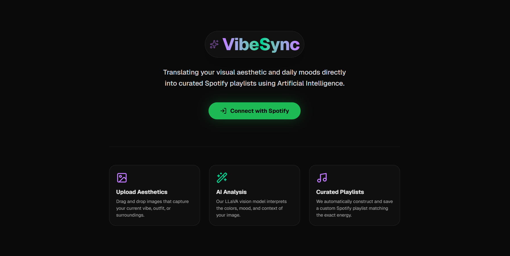
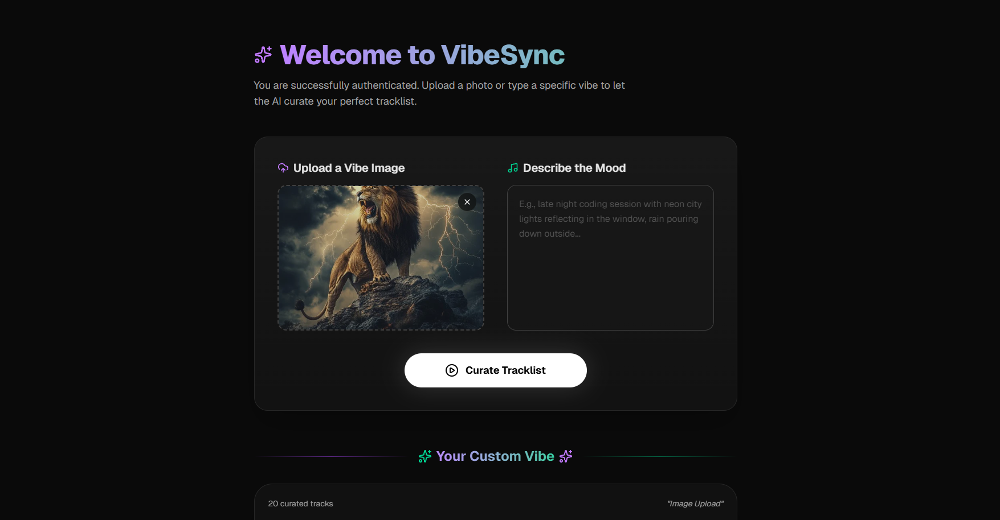
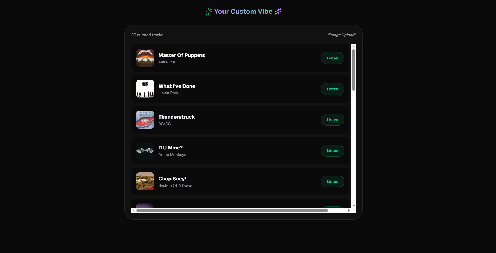

#  VibeSync

VibeSync is a multi-modal, AI-driven music curation platform. Simply upload an image or type a mood, and VibeSync's intelligent architecture will analyze the "vibe" (lighting, color palette, setting, and emotional tone) to instantly recommend a highly-curated tracklist built directly from the Spotify Search API.

---

##  Architecture

VibeSync is a modern microservices application composed of three distinct layers:

1. **Frontend (Next.js / React / Tailwind CSS)**
   - A highly-polished, glassmorphism UI.
   - Handles Drag-and-Drop image uploads and user prompts.
   - Renders the custom Spotify Tracklist recommendations natively without relying on heavy iFrames.

2. **Backend Orchestrator (Spring Boot / Java 21)**
   - Acts as the central nervous system.
   - Manages comprehensive Spotify OAuth2 Authentication via Spring Security.
   - Communicates with the AI microservice to distill raw media into deterministic musical parameters.
   - Translates AI output into sophisticated queries against the Spotify Web API.
   - Persists user generation histories to a Neon serverless PostgreSQL database using Spring Data JPA.

3. **AI Inference Service (FastAPI / Python)**
   - A lightweight AI translation layer.
   - Receives images (auto-compressed via Pillow to prevent VRAM exhaustion) and textual prompts.
   - Interfaces directly with a locally hosted **Ollama LLaVA** model.
   - Uses strict prompt engineering to force the LLaVA model into a "Master Curator" persona, returning a validated, strict JSON payload containing specific mainstream genres, target tempo, energy, and valence.

---

##  Features

- **Multi-modal Vibe Detection:** Upload a melancholic rainy window image, or type "late night cyberpunk coding", and the AI will analyze the precise aesthetic.
- **Read-Only Spotify Integration:** Safely queries the Spotify Search API to curate 20 tracks without requiring risky "Extended Access" playlist modification scopes from Developer Mode.
- **Dynamic UI:** A stunning, responsive Next.js frontend featuring rich animations, gradient lighting, and a custom scrollable tracklist component.
- **VRAM Optimizations:** The AI microservice aggressively strips image alpha-channels and downscales them via Pillow before querying the LLM, and forces Ollama model unloading to ensure stable, long-running operation without memory leaks.
- **Persistent History:** Every generated vibe and its resulting configuration is tracked securely in PostgreSQL.

---

##  Prerequisites

To run this project locally, you will need:
- **Node.js** (v18+) and `npm`
- **Java 21+** and Maven
- **Python 3.10+**
- **Docker** (optional, for local postgres testing, or use Neon)
- **Ollama** installed locally with the `llava` model pulled (`ollama run llava`).
- A **Spotify Developer** Application.

---

##  Local Development Setup

### 1. The AI Service (FastAPI)
Navigate to `ai-service/`.
1. Copy the example environment file: `cp .env.example .env`
2. Create a virtual environment: `python -m venv venv`
3. Activate it: `source venv/bin/activate` (or `.\venv\Scripts\activate` on Windows)
4. Install dependencies: `pip install -r requirements.txt` (Ensure `Pillow` is installed if not in `requirements.txt`)
5. Run the dev server: `uvicorn main:app --port 8000 --reload`

### 2. The Backend Orchestrator (Spring Boot)
Navigate to `backend/`.
1. Ensure your PostgreSQL instance is running.
2. In `src/main/resources/`, copy `application.yml.example` to `application.yml`.
3. Provide your real Neon DB credentials and your `SPOTIFY_CLIENT_ID` / `SPOTIFY_CLIENT_SECRET`.
4. Run the application via your IDE or using Maven: `./mvnw spring-boot:run`

### 3. The Frontend Client (Next.js)
Navigate to `frontend/`.
1. Install dependencies: `npm install`
2. Copy `.env.example` to `.env.local` to configure the API base URL.
3. Start the dev server: `npm run dev`
4. The application will be available at `http://localhost:3000`.

---

##  Spotify Setup Note
Ensure your Spotify Developer App is configured with the following Redirect URI:
`http://127.0.0.1:8080/login/oauth2/code/spotify`

*(Note: Use `127.0.0.1` instead of `localhost` in both Next.js and your Spotify Dashboard to prevent cross-origin cookie issues with Spring Security during the OAuth handshake).*

---

##  License
This project is open-source and available under the MIT License.
